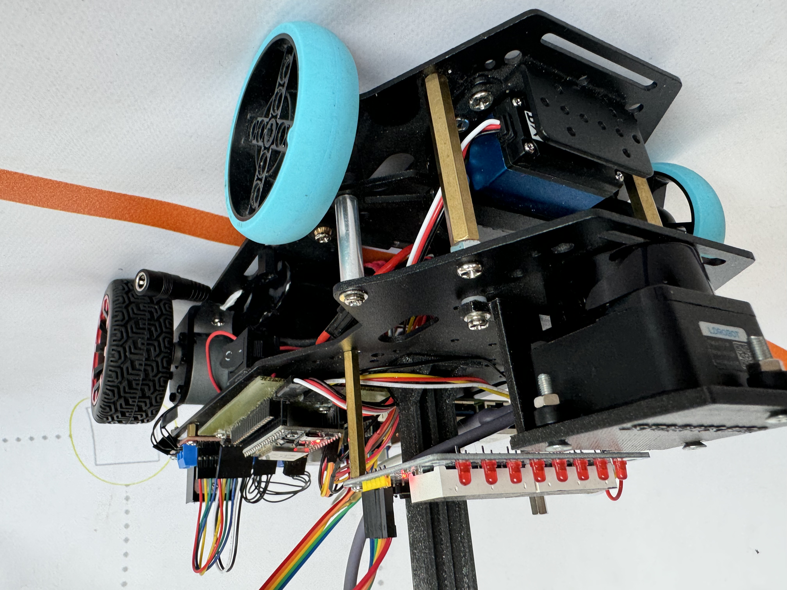
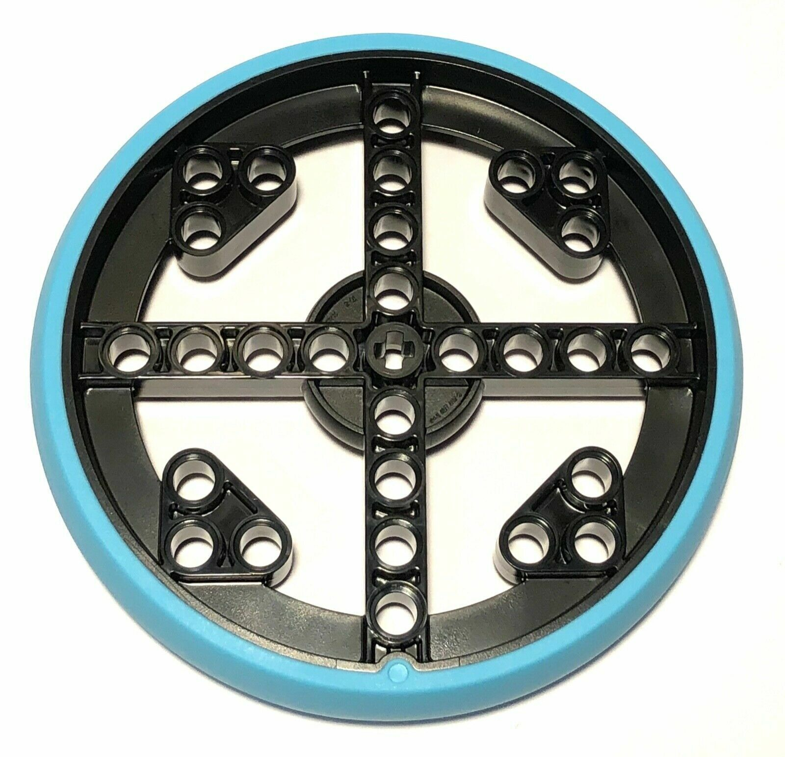

# WRO2024 FE StormsNGR
List of all documentation:
### - [Our journey](#our-journey)
### - [Challenge solution](#challenge-solution)
### - [Hardware documentation and setup guide](/schemes/README.md)
### - [Software setup guide](/src/README.md)
### - [The design process of 3d printed parts](/models/README.md)
### - [Framework guide](/src/framework.md)
### - [Videos](/video/)
### - [Connecting to the robot - RpiCode](/other/RpiCode/README.md)
### - [Robot photos](/v-photos/)
### - [Team photos](/t-photos/)
### - [Special thanks](#special-thanks)


# Our journey

  This text contains our struggles and achievements, which we have came across during our few months of preparation. **How many things we had to redesign,** how many things we had to figure out to make our robot work.
## The team
Our team consists of 2 members and a coach, we are the StormsNGR team from hungary. This is our third year competing together in WRO, but this is our first year in the Future Engineers category.

>Members
- **Csaba Molnár** from [Érdi Vörösmarty Mihály High School](http://vmg-erd.hu/)
- **András Gräff** from [Érdi Vörösmarty Mihály High School](http://vmg-erd.hu/)

>Coach
- **Zsolt Molnár**

Links to our socials:
- **Facebook**: https://www.facebook.com/stormsteam/
  - Here you can find updates about the team
- **YouTube**: https://www.youtube.com/channel/UCyzm_Su7qoRCof-ZpbG_9Ig
  - Here you can watch videos about past competitions
## Past experiences

  **Our team has been participating in WRO competitions for a few years now,** so obviously there were a few things we could carry over to Future Engineers even though **RoboMission is a really different category.** These were:
  - PID controller.
  - Experience with different types of sensors like gyro sensors and car mechanisms.
  - Coding experience, like making a framework.
  - Experience with making visual debugging systems.

  However even after having learnt this much in the past couple of years, **there were still things we weren't prepared for,** like the issues we'll have with steering gears.

## Our first design

  At first we wanted to use a [3d printable car](https://www.instructables.com/3D-Printed-RC-Car/) we found online as a base. We thought that this way we could **really fine tune it however we wanted**. In the beginning everything seemed fine, but as we progressed at assembling the car, **more and more things started going off the rails.** The build manual had a lot of steps and stl files left out, so even the build process was unreasonably difficult. But this wasn't our biggest problem. **Our biggest problem was the fact that it meant to be a quick RC car for outside usage.** It wasn't made to precise, which was the dealbreaker in our case.

  

## The current design

  For our base this time we used the [Hiwonder Ackerman Intelligent Car](https://www.hiwonder.com/products/ackermann-steering-chassis?variant=40382428381271). This was a **huge step up** from the previous design. This time the car was stable and quite fast, but this doesn't mean everything was sunshine and rainbows, there were still a lot of issues we needed to focus on. For example, when the car was *exactly* the maximum size allowed, which was fine until we noticed, that when turning, **it slighty becomes wider which made it to large to compete.** To solve this issue, we just replaced the stock tires, with Lego spike ones, which were considerably smaller.

  

  The most prominent issue in our case was the differential gear. The car came with two motors in the kit arranged in a differential drive. This was of course against the rules so we had to think of a solution as fast as possible. **We wanted to keep the power and speed** of both motors, so we decided to fix the issue with the wiring. **We wired it so that both motors would get the same input, but in reverse, causing them to output the same rotational force.**

## Our future plans

  Our future plans consist of, first of all **making our robot be able to park,** because as of right now we were not able to do that, mainly because of the sheer size of the vehicle. Secondly we will want make a **proper differential gear** to solve all confusion that might arose from our current situation. Finally, we want to update our object detection by **mapping the image of our camera and lidar to the same coordinate system** in order to be a lot more precise, but this will probably pose a huge challenge just, because of the amount of advanced math this will require.

# **Challenge solution**
This documentation showcases our unique solution to the open and obstacle challenge using pseudo-code, and lists some actual methods we used for our solution with a brief explanation.
## Our solution
Our number one concern was reliability. This can be achieved by only using a small set of movements and polishing these to perfection, among other things. To make this small set of movements we first had to **simplify** the challenge. For the open challenge we didn't have much work to do, it was already pretty simple. The only **optimization** we had was always driving on the outer lane therefore pretty much eliminating the walls' randomization's effect. For the obstacle challenge we did a number of simplifications. First, we make no difference based on the column of the traffic signs, we avoid them as if they occupy both spaces. Second, movement wise we make no difference between the first row and the second row. There can only be one traffic sign there anyway. At the start of a section with traffic signs the robot backs up to the wall so it has enough space to move to the correct side. There it detects whether there is a traffic sign in the first two rows or not. If there is the robot uses the camera to check its color. Then based on the color the robot **switches** to the correct lane. If there were no traffic signs detected we just move to the outer lane. If the detected traffic sign was not in the middle we also checks if there is a traffic sign in the third row also. If there is we then switch to the correct lane again. This movement starts about when we are just over the first row of traffic signs. We have two functions for turning the corner. One for if we are on the outer lane and one if we are on the inner lane. The code for turning around after a red traffic sign is almost entirely the same for both driving directions. Parking space detection is done at the start of a section. If found, or already found in this section we set an **offset** variable that is taken into consideration when moving relative to the wall. After completing 3 laps the robot stops, we don't attempt to park. This is a **strategic** decision, we deemed implementing parking too difficult for a small score increase. This is because our robot is too big, making perfectly parking near-impossible, and partly parking only scores 3 extra points compared to just stopping at the starting section.
## Pseudo-code
### Open challenge
```
direction: 1 if the robot has to turning right, -1 if the robot has to turning left
move to outer lane
repeat for 12 times:
    wait until 55 cm away from front wall
    arc 90° * direction
    go
wait until 140 cm away from front wall
stop
```
### Obstacle challenge
```
`parking position`: Not found
`all sections`: 12
#robot is currently at the start of a section, backed up to the back wall
repeat for `all sections` times:
    if `parking position` is Not found:
        check for parking position
    if `parking position` is in current section:
        wall offset=20
    else:
        wall offset=0
      checks for traffic signs
      if there is: 
          check color
          store color in matrix
          move to correct lane
      else: 
          move to outer lane
      wait until 180 cm away from front wall
      if detected sign is not in the middle row:
          check for traffic signs
          if there is:
              check color
              store color in matrix
              move to correct lane
          else:
              go
      wait until 70 cm away from front wall
      if current section is second lap last and final traffic sign is red:
          turn around
          decrease `all sections` by 1
          flip stored matrix
          flip `parking position`
      else:
          turn corner

wait until 140 cm away from front wall
stop
```
Both codes are very similar to our actual code which can be found at [src/RaspberryPi/full.py](/src/RaspberryPi/full.py).
## Framework challenge functions
A list of higher level functions based on the lower level framework functions detailed at [src/framework.md](/src/framework.md).

- `initLoop`
    - Displays useful information on the Led&Key panel and awaits a button press to start the round.
- `switchLane`
  - Moves to the specified lane. Automatically calculates distance based on lane parameter and wall offsets then calls the `setLane` framework function.
- `checkColor`
  - Requests the detected objects from the Pixy computer vision camera and finds the largest rectangle that is inside the specified zone and returns whether it is green or red. These 'zones' were calibrated exclude anything other than the traffic sign in front of the robot.
- `turnCorner`
  - Turns the corner automatically selecting one of the two algorithms based on which lane the robot is in (outer or inner).
- `turnAround`
  - Turns around the last red traffic sign.
## Conclusion
This being our first year in Future Engineers, we had a lot of work to do, but we are really proud of the end result. We managed to stick to our principles and make a great coding framework. This way implementing next year's extra rule won't be nearly as much of a challenge. 
# Special thanks
Special thanks to József Molnár from the [Budapest University of Technology and Economics](https://www.bme.hu/) Faculty of Mechanical Engineering for helping us with the preparations, György Fenyvesi for helping us develop our [custom made interconnect panel](/schemes/README.md/#custom-made-interconnect-panel-wiring-with-connections-labeled), József Gräff, our coach Zsolt Molnár and a bunch of others for helping us by reviewing all the documentation. And of course, to both our families for tolerating us taking up the entire living room with the robot mat 🙂.