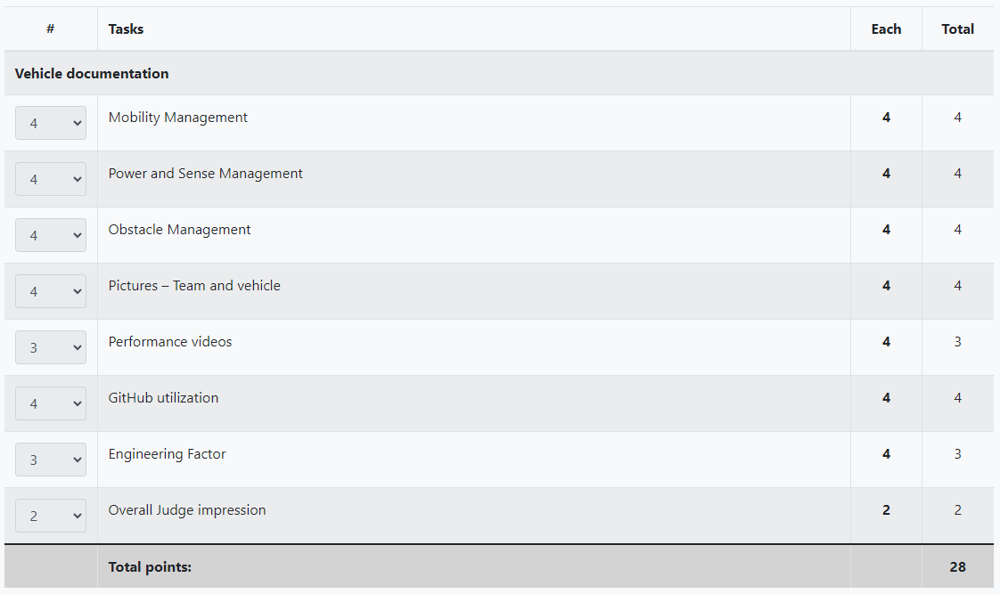
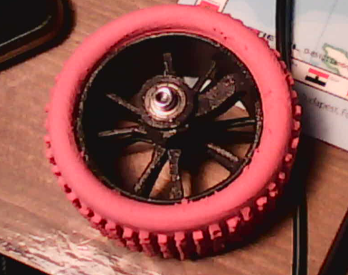
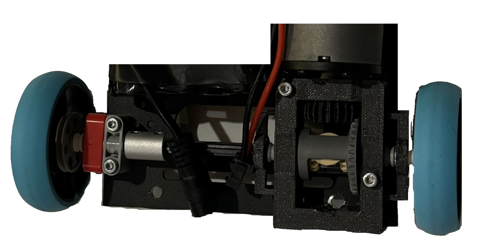
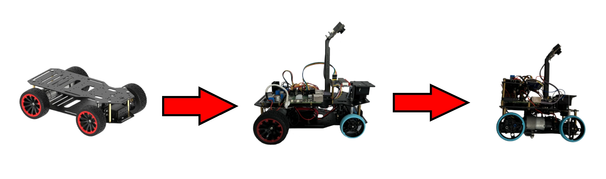

# Preface

As you may know (since you are visiting this documentation 😉) we are the WRO Future Engineers 2024 world champions 🎉. This documentation won us the championship with a score of 28 points, the competition was fierce.

A breakdown of our score:

This can be viewed online [here](https://scoring.wro-association.org/en/fe2022/fe2022/sheet/show/18872/DOCUMENTATION).

The documentation will be kept up and public for the foreseeable future, we will be updating it as we keep developing the robot in our second year. We hope you find this useful, get inspired by it or take some core ideas and implement them into your own solution!

Once again, we are insanely happy, and congratulations to all competing teams!

## 2025 season
We will be keeping this repository as it is, and will be documenting our development process and preparations on a seperate, [2025 season repository](https://github.com/MoCsabi/WRO2025-FE-StormsNGR)
# Table of contents
### [Our journey](#our-journey)
### [Ideas and principles](/Ideas_and_principles.md)
### [Hardware documentation](/schemes/README.md)
### [Software documentation](/src/README.md)
### [Measurent- The robot's mechanical characteristics](/The%20robot's%20mechanical%20characteristics.md)
### [RpiCode development tool documentation](/other/RpiCode/README.md)
### [Videos](/video/video.md)
### [Team Photos](/t-photos/)
### [Vehicle Photos](/v-photos/)
# Our journey

  This text contains our struggles and achievements, which we have came across during our few months of preparation. **How many things we had to redesign,** how many things we had to figure out to make our robot work.

## The team
Our team consists of 3 members and a coach, we are the StormsNGR team from hungary. This is our third year competing together in WRO, but this is our first year in the Future Engineers category.

>Members

- **Csaba Molnár** from [Érdi Vörösmarty Mihály High School](http://vmg-erd.hu/)
  - csabi@molnarnet.hu
- **András Gräff** from [Érdi Vörösmarty Mihály High School](http://vmg-erd.hu/)
  - andrasgraff@gmail.com
- **Levente Molnár** from [Andreetti Károly Elementary School](https://iskola.soskut.hu/)
  - levi@molnarnet.hu

>Coach

- **Zsolt Molnár**
  - zsolt@molnarnet.hu

Links to our socials:

- **Facebook**: https://www.facebook.com/stormsteam/
  - Here you can find updates about the team
- **YouTube**: https://www.youtube.com/channel/UCyzm_Su7qoRCof-ZpbG_9Ig
  - Here you can watch videos about past competitions
- **Instagram**: https://www.instagram.com/storms_team_hun/
  - Cool posts and updates about our, and our sister-team StormsRMS' preparation for upcoming competitions

## Past experiences

  **Our team has been participating in WRO competitions for a few years now,** so obviously there were a few things we could carry over **RoboMission** even though **Future Engineers** is a really different category. These were:
  - PID controller
  - Experience with different types of sensors like gyro sensors and car mechanisms
  - Coding experience, like making a framework
  - Experience with making visual debugging systems

  However even after having learnt this much in the past couple of years, **there were still many entirely new challenges in this category,** such as the construction of an entire robot car, and the difficulties of steering movement instead of differential drive.

## Our first design

  At first we wanted to use a [3d printable car](https://www.instructables.com/3D-Printed-RC-Car/) we found online as a base. We thought that this way we could **really fine tune it however we wanted**. In the beginning everything seemed fine, but as we progressed at assembling the car, **more and more things started going off the rails.** The build manual had a lot of steps and stl files left out, so even the build process was unreasonably difficult. But this wasn't our biggest problem. **Our biggest problem was the fact that it meant to be a quick RC car for outside usage.** It wasn't made to precise, which was the dealbreaker in our case.

  

## The current design

  For our base this time we used the [Hiwonder Ackerman Intelligent Car](https://www.hiwonder.com/products/ackermann-steering-chassis?variant=40382428381271). This was a **huge step up** from the previous design. This time the car was stable and quite fast, but this doesn't mean everything was sunshine and rainbows, there were still a lot of issues we needed to focus on. The car was *exactly* the maximum size allowed, which made parking near-impossible. For the national finals this was not a problem, but we still had to make some improvements to the chassis, such as changing the tyres to Lego Spike tyres, since it was the original ones were so wide that by turning the robot would exceed the size limit, and of course installing all the different components.

  The most prominent issue we had to solve was the **differential gear.** The car came with two motors in the kit arranged for and electric differential drive. This was decided against by the head judges so we had to think of a solution as fast as possible. For the national finals we fixed the issue with wiring. **We wired it so that both motors would get the same input, but in reverse, causing them to always output the same rotational force.** This way we kept both the **power** and **speed** of both motors. However for the international championship we had to implement a differential gear solution. 
  After multiple iterations we ended up using a design which **mixes official lego elements, metal technic parts and custom 3d printed parts.** Making this took a ton of time and consideration and we are incredibly happy with how it turned out.

  

  This was the hardest mechanical problem to solve, but we also faced many others, such as securing the motor in its new position, changing **all** tyres to Lego tyres and figuring out how to install the third deck.
  
  

  After our hardware issues were solved it was finally time to face the software ones. **The color sensing needed a lot of work,** but we found a solution that looking back was kind of obvious. If we can't see it enough, just go closer. We actually realized this **during** the national competition, where the lighting was very different from the one at home, and managed to implement a makeshift solution and managed to increase detection accuracy above what we measured at home. Later at home we perfected this solution and this approach proved to be really effective and had **immense results.** The other thing was adding the parking, which added a lot more complexity to the already complex enough run. Once we finally did all this, **the only thing left to do was polish up and thoroughly test everything.**

## Teamwork

  We usually met up once a week to work on this project, **but even when we weren't together we would work on it.** We kept a log of all the times we worked on something. Everyone had a part of this project that they were the most familiar with, and so when we were not together we would usually work on those parts and then share our code snippets and unfinished or work in progress documentation via a **private GitHub**, finally publishing it on the official one. Any chance we got we would talk or text about what to do, what we should focus on, frequent **communication** was a key part of our work. We needed to have a clear goal every time in order to not get sidetracked and waste our time on the unimportant things. Every week when we met up, first we merged everything we did separately together and then did the things that all of us were needed for. This way even though we only met up once a week, **we could have a constant flow of progress.** It's important that even though every member of our team had an area of the project they were most familiar with, we still strived to introduce each other ot our own areas, so that everyone is familiar with the whole project as a whole. We believe this is necessary for efficient teamwork.

# Conclusion
  This was a very challenging project, **but we are really happy with how far we had come** and are very hopeful looking in to the future. We learned a ton during this time, immersed ourselves in multiple wired communication protocols, learned about different hardware and all in all **we just spent our time very productively** while solving this quite difficult challenge.

# Special thanks
Special thanks to József Molnár from the [Budapest University of Technology and Economics](https://www.bme.hu/) Faculty of Mechanical Engineering for helping us with the preparations, György Fenyvesi for helping us develop our [custom made interconnect panel](/schemes/README.md/#custom-made-interconnect-panel-wiring-with-connections-labeled), József Gräff, our coach Zsolt Molnár and a bunch of others for helping us by reviewing all the documentation. And of course, to both our families for tolerating us taking up the entire living room with the robot mat 🙂.