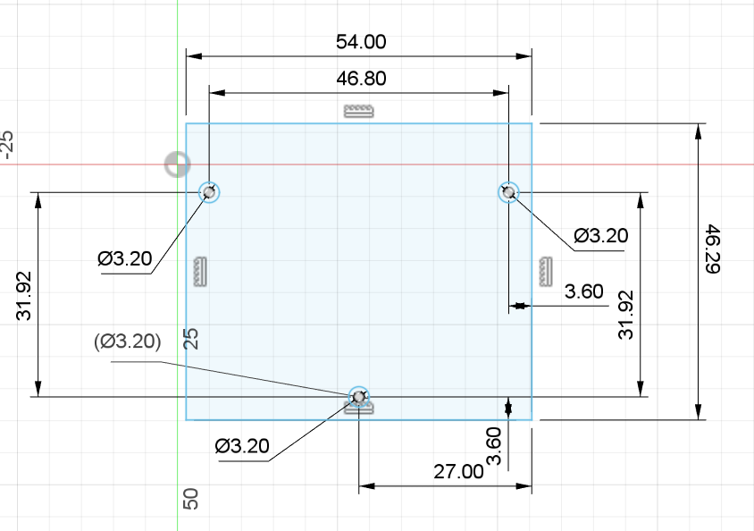

# The design process of 3d printed parts

Designing and printing out different parts of the robot was one of our biggest task where we had to take a lot of things into account in order **for everything to work properly**. Sometimes we had to rely on **trial and error** to make sure everything was how we wanted it to be.

---

## The steps of The design process:

### 1. Coming up with the general shape and location of the part
  
  In This part we first had to take a close look at how our robot looked so far then try to figure out **how and where our soon to be designed part could fit.**
  Things we had to look out for:
  - Having an appropriate amount of space for the parts.
  - Having the right screw holes to be able to make a good mounting mechanism.
  - Making sure that putting the part there wouldn't interfere with anything else.
  
  After we found to correct location we made a very, **very simplistic sketch** of what we wanted.
  
  
  
  

### 2. Gathering usable documentation
  This is maybe the most important part in the process, because the quality of the documentation available **can make or break a design**. While taking your own measurements is viable, it is a lot simpler to use a documentation and yields **more precise results**.

### 3. Making the model
  We used *Autodesk Fusion 360* for designing our parts, however any industrial software like *Autodesk Inventor* can be used. In the modelling process there are a couple of things to remember:
  
  - Make sure that any measurement given in a documentation seems realistic, **since we have seen mistakes even in official documentations**.
  - Always double check any calculation and check the dimensions relative to multiple sides, because **it may look alright from one side, but may be completely unusable from another**.
  - Use your software's built in physics simulators to check for weak points and **always make sure it can handle the stress it may be placed under**.
  
  
  
  
### 4. Exporting the G-code
  We printed our parts with a *PRUSA mini+* and used *PrusaSlicer*, but any 3d printer and software will do as long as it has a **large enough print** area and supports the **right types of filament**. We suggest that for more **aesthetic parts a 30% infill** is used and for **more structural ones a 60%**. It may also seem trivial but the **angle and orientation** in which the part is printed matters a lot to. For example **for tires a $45°$ tilt** is suggested to make sure that it **won't come apart parallel to the print lines.**

### 5. Printing out the part
  Here there is not much to look out for, just make sure that the **printer's settings are right,** there is enough filament and the **supports are sufficient.** What type of filament is used doesn't really matter that much aswell, as long as it is not a flexible filament like TPU. We used *Prusament PLA*, but PETG is probably fine too.

---

## How we applied these steps and the difficulties we faced

### The lidar mount

  The lidar mount was the *first part* which we designed ourself and the part that makes it so that the lidar can see **exactly what we want it to see.** While the robot chassis had the right screw holes to mount it to begin with, the problem we faced relied in the **angle in which the lidar shoots out its beams of light.** It was slightly angled to shoot upwards. Because of this the lidar was **seeing above the walls** of the map which was a lot less than optimal. Our solution was to flip the lidar upside down to **lower the starting point of the beams and make them shoot slightly downwards instead.**
  The main things we had to look out for in this part were:
  
  > **Making sure that it won't start tilting in random directions throughout the round.**
  
  The way we solved this was, that the mount just makes it so that it doesn't move horizontally, but vertically it doesn't give much support, **letting it lie directly flat on the vehicle**.
  
  > **Mounting it securely while leaving enough space for a wide field of view.**

  We solved this by only mounting it from the back with two screws, which does give up a lot of stability, but we **still found it sufficient for this use case**.
  [The documentation we used (Page 7 is the most important)](https://www.ldrobot.com/images/2023/05/23/LDROBOT_LD19_Datasheet_EN_v2.6_Q1JXIRVq.pdf)

  

  Final result is in the [Lidar_mount.f3d](Lidar_mount.f3d) file, [STL file here](Lidar%20stand.stl)

### The camera stand
  The camera stand was the *second part* that we have designed, but due to its **height** and the **torque that can happen** because of it, it had to be partially redesigned multiple times. Its main goal was to **elevate our Pixy camera by about $10 cm$ s and had it be rotated looking at the ground in a $45°$ angle.** The main reason for this was to control how much of the map it saw. We only wanted it to see the **current closest object**, however that was not something we could realistically achieve. Because of this, we wanted it to be as in the front as possible so we first decided to put it [on top of the lidar mount.](#sketch)

   [STL file](Camera%20stand.stl)

  However this has caused some problems. In some places when the robot was going the torque that was generated **made the lidar under it tilt**, causing it to see the floor. To resolve this, we made a new design that was **no longer on top of the lidar, but further back.**

   [STL file](Camera%20stand%202%20v1.stl)

  >This version had a couple of different changes:
  >- **The height was increased** in account of the loss when taken of the lidar.
  >- Mounting area was decreased due to the lack of space, **now using only two screw holes.**
  >- A little bar was added on both sides to increase structural integrity, however this has **proved to be insufficient later on.**

  Before we could even mount this one, it has bent too much and **snapped at one of the printing lines in the middle,** therefore some structural changes had to be made to make it stronger.

   [STL file](Camera%20stand%202%20v2.stl)

  > There were only two changes this time:
  >- On top of the little bar on both sides another set of **thicker bars have been added in the four corners,** which greatly improved stability.
  >- Before printing it has been rotated by $90°$ so that the **printing lines would be in a stronger orientation.**

  This version has worked for a long time, even if it was tilting a little, because the small base, until testing, our dog run over the robot and **snapped it at the screw holes.**
  
    [STL file](Camera%20stand%202%20v3.stl)
  
  > Besides the text, there has only been one change in this version. The base was **heavily widened** and supporting triangles have been added, **eliminating the tilting and solidifying the structure.**

  This is the version we are using right now and hopefully will be continuing using, **without needing to make any changes.**

  [The documentation we used](https://docs.pixycam.com/wiki/doku.php?id=wiki:v2:dimensions&s[]=dimensions)
  *On the image it says that the two screw holes have a distance of $6mm$ however this is incorrect according to the description given below and calculations we did ourselves.*

---

## Conclusion
  
  Designing custom 3d printed parts is hard and while sometimes we can get lucky, like with the lidar mount, **other times it may take a long time and multiple versions until we get it right.** The step by step guide was written according to the **things we learned during our process and things we will be doing in the future.** Making sure that a design is good can be one of the most important steps during the entire process of making a robot. It is of the upmost importance to make sure that **the amazing software one might have doesn't get bottlenecked by bad parts.**
