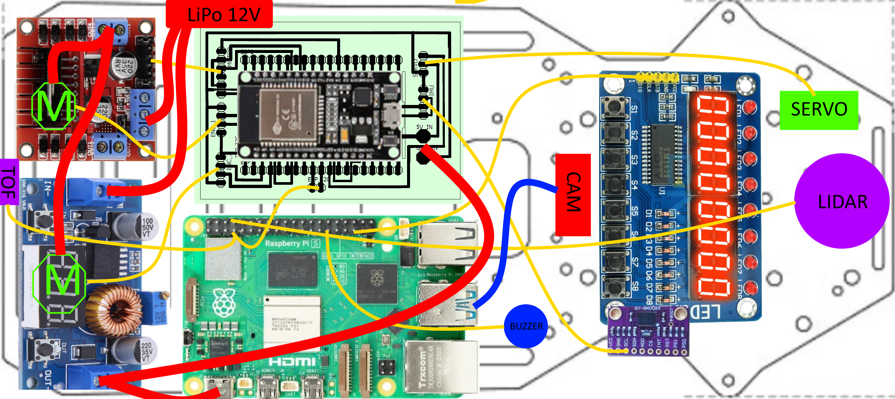
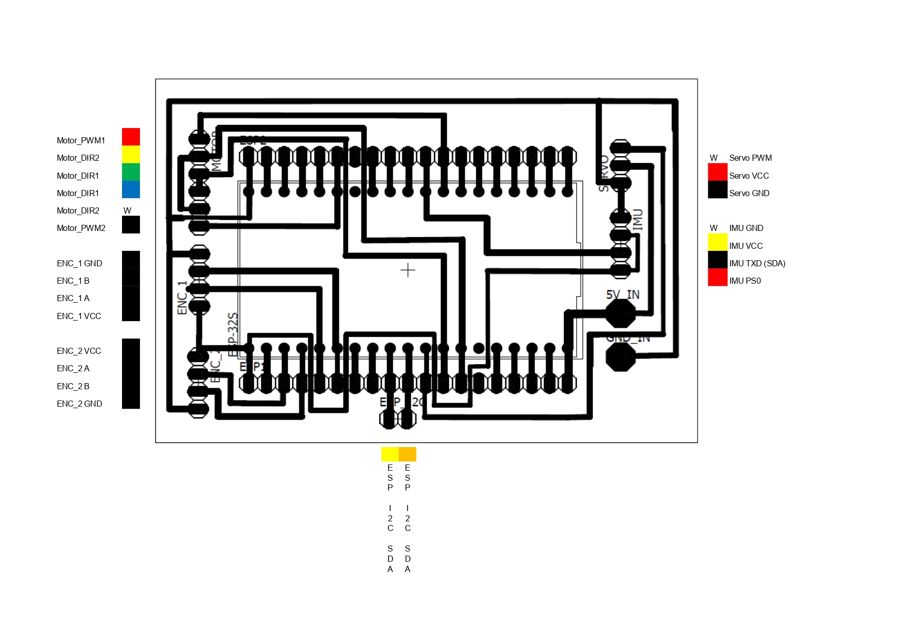

# Hardware documentation and setup guide
This document list the robots various sensors and components, describes their wiring, and documents our assembly process.

## List of components
We installed a lot of sensors and other components on the car, here is a list of each of them with a link and some additional quick notes:
- **Base car** [Ackermann Intelligent Car](https://www.hiwonder.com/collections/robotic-car/products/ackermann-steering-chassis?variant=40382428381271)
  - 270 x 197 mm, 960 g
- **Steering servo** [Carson CS-3](https://www.amazon.co.uk/Carson-500502015-500502015-CS-3-Servo-3Kg-JR/dp/B0037Y93CW)
  - Operating voltage 4.8 - 6 V, torque 31 Ncm, operating time 0.17 sec/60° dimensions : 38.5 x 19 x 32 mm, weight: 39 g
- **2 DC motors** [Hiwonder JGB37-520R30-12](https://www.hiwonder.com/products/hall-encoder-dc-geared-motor?variant=40451123675223)
  -  Operating voltage 12V, torque 15 kg*cm max 3.2A, 280 RPM, 440 pulse-per-revolution encoder
- **Single Board Computer** [Raspberry Pi 5 4GB](https://www.raspberrypi.com/products/raspberry-pi-5/?variant=raspberry-pi-5-4gb)
  - Operating voltage 5V/5A USB-C, 4 USB ports, 40 pins
- **Microcontroller (ESP)** [NodeMCU-32S](https://www.hestore.hu/prod_10037961.html)
  - Operating voltage 5V, 2*19 pins, dimensions: 49.5 x 26 mm
- **Custom panel**
  - ESP pins insert into this
- Inertial Measurement Unit (**IMU**) [BNO085](https://www.hestore.hu/prod_10044901.html)
  - Operating voltage 3.3V, drift 0.5°/min, dynamic rotation error 4.5°
- **Motor driver** [L298N-MOD](https://www.hestore.hu/prod_10036621.html)
  - Output 2*5A max
- **Step-down module** [XL4015-3D-STDN-PSU](https://www.hestore.hu/prod_10042112.html)
  - Output 5V/5A, displays incoming voltage, useful for checking battery state
- **Battery**
  - Bundled with car, 11.1V, 6000mAh
- **Display and buttons panel** [Led&Key](https://www.hestore.hu/prod_10042203.html)
  - 8 seven segment displays, buttons, LEDs
- **Active buzzer** [Z2 buzzer (KPI-G2330E)](https://www.hestore.hu/prod_10029469.html)
  - Operating voltage 3-24V DC, 3700 Hz, 83 dB, dimensions ⌀23x10mm
- **Power switch** [ST 1/BK (MRS-1)](https://www.hestore.hu/prod_10023322.html)
  - Dimensions 19.3x12.9mm
- **LiDAR sensor** [LDROBOT D500 LiDAR Kit](https://www.elektor.com/products/ldrobot-d500-lidar-kit-360-degree-laser-range-scanner-12-m)
  - Dimensions 38.6 x 38.6 x 34.8 mm, range 0.02-12 m, frequency 5-13 Hz, accuracy ±45 mm, comes with development kit which we aren't using
- **Camera** [PixyCam 2.1](https://tribotix.com/product/pixycam2-1/)
  - Built-in color detection algorithm, field of View: 80° horizontal 40° vertical, integrated lights, up to 60 fps
- **Laser Time of Flight distance sensor** [VL53L0X V2TOF](https://vi.aliexpress.com/item/1005006706036794.html)
  - Operating voltage 3-5V, dimensions 12.5 x 25 mm, measure distance 2m
## Assembly
The base of our robot is the [Ackermann Intelligent Car](https://www.hiwonder.com/products/ackermann-steering-chassis?variant=40382428348503) from [HiWonder](hiwonder.com), however many modifications were made to the chassis. First, we didn't use the motor controller boards that came with the car, and instead opted to write the speed controlling code ourselves. Partly because this way we can fine-tune the algorithm better, and partly because we ended up short-circuiting the board due to a documentation error. The second biggest change we did was changing the front tyres to [Lego Spike tyres](https://www.brickowl.com/catalog/lego-wheel-56-with-medium-azure-tire-39367). This wheel didn't have the same diameter as the default one, so the front of the robot moved down a bit. Surprisingly, this is exactly what made the car **level**. For some reason the car had uneven size spacers installed. This may have been intentional, however, for us, the car being level was preferred important. We also replaced the steering servo with a slightly different model, again, partly because this one needs lower current and voltage, and partly because we accidentally melted the other one down. We also made a custom interconnect board made with a professional which made our wiring much cleaner.

(Sketch that illustrates the connections between the different components of the robot)

## Power
A simple explanation of the power supply hierarchy of our robot.
- Battery 12V
  - Step-down module `12V-->5V`
    - Steering servo `5V`
    - Raspberry Pi 5 `5V` (from USB-C)
      - LiDAR `5V`, **180mA**
      - Camera `5V` **140mA** (micro USB)
      - Led&Key Panel `5V`
    - NodeMCU-32S `5V` (from Vin pin)
      - Inertial Measurement Unit `3.3V`
      - 2 motor encoders `3.3V/5V`
  - Motor driver `12V`
    - 2 DC motors `12 V` **~3A**
## Wiring diagrams
### ESP microcontroller (NodeMCU) pinout with connections labeled:

(ENC-Motor encoder, PI-Raspberry Pi)
### Custom-made interconnect panel wiring with connections labeled:

(ENC-Motor encoder)

A CAD model is also available in the [ESP_v8.sch](/ESP_v8.sch) file.
### Raspberry Pi pinout with connections labeled:

(NC-Not Connected, L&K-Led and Key panel, TOF-Laser distance sensor)

All of these can also be found in the form of an excel spreadsheet in the [pinouts.xlsx](/pinouts.xlsx) document.
## Protocols
The different communication protocols used between the components of the robot and their hierarchy
- Computer
  - Raspberry Pi `SSH`
    - ESP `I2C` **(SDA-GPIO 2, SCL-GPIO 3)** 
      - IMU `UART-RVC` **(SDA-GPIO 17)**
      - 2 encoders `Digital` **(Left: A-GPIO 36, B-GPIO 39; Right: A-GPIO 34, B-GPIO 35)**
      - Motor driver `PWM` 2x`Digital` **(ENA-GPIO 12, ENB-GPIO 14, PWM-GPIO 21)**
      - Servo `PWM` **(Signal-GPIO 27)**
    - Laser distance sensor `I2C` **(SDA-GPIO 2, SCL-GPIO 3)** 
    - LiDAR `UART` **(TX-GPIO 15)** 
    - Led&Key panel `Data, Strobe, Clock` **(DIO-GPIO 19, STB-GPIO 6 & GPIO 26, CLK-GPIO 13)**
    - Buzzer `Digital` **(+-GPIO 5)**
    - Camera `USB`

Communication between the Raspberry Pi and the computer is handled by our custom-made Visual Studio Code extension, RpiCode. It creates the SSH connection over WiFi or Ethernet. Between the Raspberry Pi and the microcontroller we have an `I2C` communication set up where the microcontroller is the slave and the Pi is the master. We created a custom command set that enables the Pi to request data (such as sensor readings) from the microcontroller or send data (for example the new target motor speed) to the microcontroller. Due to a weird bug that has to do with `I2C` and ESP microcontrollers we always have to request data twice on the Pi side. The Raspberry Pi receives data from the LiDAR using the `UART` communication protocol. We couldn't find a Python library for processing the LiDAR input, so we had to write our own. This can be found in [src/RaspberryPi/LidarService.py](src/RaspberryPi/LidarService.py). The LiDAR's communication protocol is detailed here in the [official development manual](https://www.ldrobot.com/images/2023/05/23/LDROBOT_LD19_Datasheet_EN_v2.6_Q1JXIRVq.pdf) (starting at page 7). For the Led&Key panel we luckily found a preexisting Python library that we could just simply install. The same was true for the laser distance sensor which was on the same **I2C bus** as the ESP. More on these libraries in the [software setup guide](/src/README.md). Using the buzzer was also really simple, we just had to set the `+` pin to **HIGH** to start the sound and to **LOW** to stop it. For the Pixy Camera we followed [this tutorial](https://docs.pixycam.com/wiki/doku.php?id=wiki:v2:hooking_up_pixy_to_a_raspberry_pi2) to install the Python library. For the IMU we opted to use `UART-RVC` communication protocol. The RVC stands for Robot Vacuum Cleaner, because it's primarily used to help navigate automatic vacuum cleaners. We choose this mode because this was the simplest one to implement, the sensor just sends the positional data 100 times a second, no need for complicated requests. For the encoders we registered the **A** and **B** pins as interrupt pins, and counted how many times they go from **HIGH** to **LOW** or vice-versa, and from this we would calculate the speed of the robot. Steering with the servo is achieved by sending a `PWM` signal to the servo with the correct **dutycycle**. The motor driving code was originally planned to utilize differential drive, however since that was not allowed we are only using one output of the motor driver, to avoid any potential misunderstandings.
## Conclusion
We had quite a few difficulties during the assembly and planning process, but we are very proud of our work. If there are any problems or further questions don't hesitate to contact us at csabi@molnarnet.hu (Csaba) or andrasgraff@gmail.com (András)