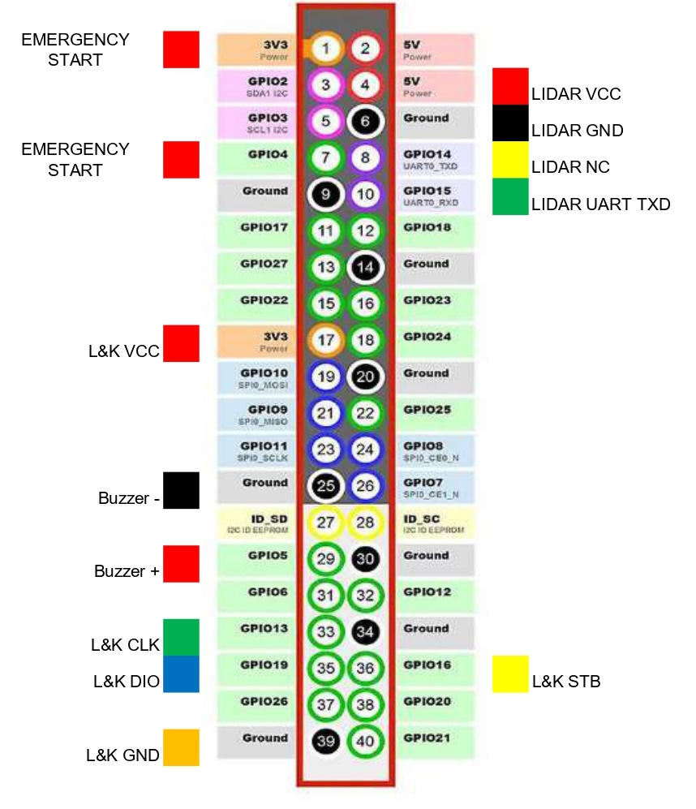

# Hardware documentation and setup guide
The robot is made up of a lot of different sensors, motors and two processing units, the ESP microcontroller and a Raspberry Pi. The base of the car is a heavily modified Ackermann steering car chassis. We had to create a lot of custom 3D printed components and even a custom interconnect panel to help with complicated wiring. The power to the robot is supplied by a 11.1V lithium battery and is later converted to 5V by a step-down module. For driving we use 1 motor through a motor controller, with a differential gear solution, and for steering a servo, while utilizing Ackermann geometry.

## List of components
We installed a lot of sensors and other components on the car, here is a list of each of them with a link and some additional notes:
- **Base car** [Ackermann Intelligent Car](https://www.hiwonder.com/collections/robotic-car/products/ackermann-steering-chassis?variant=40382428381271)
  - originally 270 x 197 mm, 960 g
- **Steering servo** [Carson CS-3](https://www.amazon.co.uk/Carson-500502015-500502015-CS-3-Servo-3Kg-JR/dp/B0037Y93CW)
  - Operating voltage 4.8 - 6 V, torque 31 Ncm, operating time 0.17 sec/60° dimensions : 38.5 x 19 x 32 mm, weight: 39 g
- **DC motor** [Hiwonder JGB37-520R30-12](https://www.hiwonder.com/products/hall-encoder-dc-geared-motor?variant=40451123675223)
  -  Operating voltage 12V, torque 15 kg*cm max 3.2A, 280 RPM, 440 pulse-per-revolution encoder
- **Single Board Computer** [Raspberry Pi 5 4GB](https://www.raspberrypi.com/products/raspberry-pi-5/?variant=raspberry-pi-5-4gb)
  - Operating voltage 5V/5A USB-C, 4 USB ports, 40 pins
- **Microcontroller (ESP)** [NodeMCU-32S](https://www.hestore.hu/prod_10037961.html)
  - Operating voltage 5V, 2*19 pins, dimensions: 49.5 x 26 mm
- **Custom panel**
  - ESP pins insert into this
- Inertial Measurement Unit (**IMU**) [BNO085](https://www.hestore.hu/prod_10044901.html)
  - Operating voltage 3.3V, drift 0.5°/min, dynamic rotation error 4.5°
- **Motor driver** [L298N-MOD](https://www.hestore.hu/prod_10036621.html)
  - Output 2*5A max
- **Step-down module** [XL4015-3D-STDN-PSU](https://www.hestore.hu/prod_10042112.html)
  - Output 5V/5A, displays voltage, useful for checking battery state
- **Battery**
  - Bundled with car, 11.1V, 6000mAh, lithium
- **Display and buttons panel** [Led&Key](https://www.hestore.hu/prod_10042203.html)
  - 8 seven segment displays, buttons, LEDs
- **Active buzzer** [Z2 buzzer (KPI-G2330E)](https://www.hestore.hu/prod_10029469.html)
  - Operating voltage 3-24V DC, 3700 Hz, 83 dB, dimensions ⌀23x10mm
- **Power switch** [ST 1/BK (MRS-1)](https://www.hestore.hu/prod_10023322.html)
  - Dimensions 19.3x12.9mm
- **LiDAR sensor** [LDROBOT D500 LiDAR Kit](https://www.elektor.com/products/ldrobot-d500-lidar-kit-360-degree-laser-range-scanner-12-m)
  - Dimensions 38.6 x 38.6 x 34.8 mm, range 0.02-12 m, frequency 5-13 Hz, accuracy ±45 mm
- **Camera** [PixyCam 2.1](https://tribotix.com/product/pixycam2-1/)
  - Built-in color detection algorithm, field of View: 80° horizontal 40° vertical, integrated lights, up to 60 fps
- **Balls bearings**
  - 4 x 5 mm diameter and 1 x 6 mm diameter
- **USB-TTL bridge** [CH341T-V3-M](https://www.hestore.hu/prod_10044421.html)
  - supports both 3.3V and 5V, enables us to use another serial port on the Pi for UART communication
- **Metal Technic Parts** [axel shaft CONNECTOR](https://metal-technic-parts.com/products/technic-aluminium-metal-axle-shaft-connector-coupling-joiner)
  - uses screws to attach to the axles, we used it as a fixed-spacer
- [**Carbon fiber Lego technic axle**](https://joooooy.com/products/moc-carbon-fiber-technic-axle-4519-3705-32073-3706)
  - can be cut to size, heavy-duty, won't bend as easily
## Assembly
The base of our robot was the [Ackermann Intelligent Car](https://www.hiwonder.com/products/ackermann-steering-chassis?variant=40382428348503) from [HiWonder](hiwonder.com), however by now we drastically modified almost everything. We cut off nearly half of the bottom and top deck and installed a third deck. We also changed the 4 tyres to [Lego Spike tyres](https://www.brickowl.com/catalog/lego-wheel-56-with-medium-azure-tire-39367). We also achieved some width decrease since these tyres were thinner than the original ones. All these size decreases were necessary to make parking possible, which was our main goal when transforming the base kit. The final dimensions of the robot ended up being `189 mm` by `164 mm` with a height of `252 mm`. The drastic decrease in length also resulted in a much smaller turning radius, since the length between the two axles is proportional with the turning radius. $R= {H \over tan(Θ)}$, where $H$ is the distance between the axles and $Θ$ is the turning angle. Our goal was to achieve a turning radius small enough to comfortably go from the outer lane to the inner lane between two traffic signs, which we achieved with a turning radius of ~35 cm. We also replaced the steering servo with a slightly different model, partly because this one needs lower current and voltage, and partly because we accidentally melted the other one down, but this model was also just a little smaller and enabled us to cut some off from the front of the robot too. We also made a custom interconnect board with the help of a professional which made our wiring much cleaner, by routing the common pins together and allowing us to use ribbon cables.

 

(Sketch that illustrates the connections between the different components of the robot)
## Wiring diagrams
The colored squares represent the cable colors on the robot.
### ESP microcontroller (NodeMCU) pinout with connections labeled:
This illustration is most important for the source code, since everything is actually wired through the custom-made board for the ESP.

(ENC-Motor encoder, PI-Raspberry Pi)
### Custom-made interconnect panel wiring with connections labeled:

(ENC-Motor encoder)

A CAD model is also available in the [ESP_v8.sch](ESP_v8.sch) file.
### Raspberry Pi pinout with connections labeled:

(NC-Not Connected, L&K-Led and Key panel)
### Motor controller wiring:

All of these can also be found in the form of an excel spreadsheet in the [pinouts.xlsx](pinouts.xlsx) document.
## Power
A simple explanation of the power supply hierarchy of our robot.
- Battery `12V`
  - Step-down module `12V-->5V`
    - Steering servo `5V`
    - Raspberry Pi 5 `5V` (from USB-C, can supply `3.3V`)
      - LiDAR `5V`, **180mA**
      - Camera `5V` **140mA** (micro USB)
      - Led&Key Panel `3.3V`
    - NodeMCU-32S `5V` (from Vin pin, can supply `3.3V`)
      - Inertial Measurement Unit `3.3V`
      - Motor encoder `3.3V`
  - Motor driver `12V`
    - DC motor `12V` **~1A**

## Connections
The different connections used between the components of the robot and their hierarchy:
- Computer
  - Raspberry Pi `SSH`
    - ESP `UART` Pi: **USB-TTL** - ESP: **RXD-GPIO-25, TXD-GPIO-26**
      - IMU `UART-RVC` **(SDA-GPIO 17)**
      - Motor encoder `Digital` **(A-GPIO 34, B-GPIO 35)**
      - Motor driver `PWM` 2x`Digital` **(ENA-GPIO 12, ENB-GPIO 14, PWM-GPIO 21)**
      - Servo `PWM` **(Signal-GPIO 27)**
    - LiDAR `UART` **(TX-GPIO 15)** 
    - Led&Key panel `Data, Strobe, Clock` **(DIO-GPIO 19, STB-GPIO 16, CLK-GPIO 13)**
    - Buzzer `Digital` **(+-GPIO 5)**
    - Camera `USB`

The actual communication between the components is detailed in the [software documentation](/src/README.md#sensors-and-motors).
## Drive
For steering, we utilize Ackerman steering geometry.
In short, the inner wheel turn slightly more than the other, so the robot stays on the same arc without any slippage. Here's an image from the [Hiwonder documentation](https://drive.google.com/drive/folders/11k0gbcZExI4076KJ1d_CCIdDlopuYUwO) that illustrates the principle:

We use two kinds of turning, turning along an arc or turning until a target degree is reached using **PID** control with the gyro. For turning along an arc we can use this formula to calculate the correct servo angle:
$$θ=arctan \left( {H \over R} \right)$$
($H$-distance between front and rear axles, $R$-target radius)

For driving we wanted to use [Electronic Differential](https://en.wikipedia.org/wiki/Electronic_differential), which is simply simulating a differential using software by calculating the required force using the current angle of the servo.
The formula for calculating the correct speeds of the two motors:
$${V_l}=\frac V R*\left( R-\frac D 2 \right)$$
$${V_r}=\frac V R*\left( R+\frac D 2 \right)$$

($V_l$- left motor speed, $V_r$- right motor speed, $R$- current arc, $V$- robot tangential speed)

This would have been the most ideal solution, as this way we could avoid complicated hardware components and also use the power of 2 DC motors easily. This is also how many modern real life electric cars operate (such as the [Tesla Model S](https://en.wikipedia.org/wiki/Tesla_Model_S#Powertrain) for example), and since the competition's main goal with car restrictions seem to be realism we hoped this solution would be accepted. However, with the reasoning that cheating by not accurately simulating a differential would be hard to detect, this solution was not allowed by the head judges. So we had to implement a differential gearbox, and only use 1 DC motor. We used a combination of official Lego parts, Lego compatible [Metal Technic Parts](https://metal-technic-parts.com/) (specifically the [MTP axel shaft connector](https://metal-technic-parts.com/products/technic-aluminium-metal-axle-shaft-connector-coupling-joiner), used as a fixed spacer), a carbon fiber axle and [3D printed components](#the-design-process-of-3d-printed-parts). The carbon fiber axle was cut down to the right size in two parts. Originally we planned to only use Lego, but we noticed that the carbon fiber axles are grinding down the Lego beams, while also producing a worrying screeching sound. To solve this we had to use ball bearings around the axles, and since these had no way to fit inside Lego beams we had to create our own differential gearbox housing with space for ball bearings. This model can be found in the [3D printed parts folder](/models/). In the end it worked just like before except without the screeching noise. We are really happy with this, as we no doubt considered implementing a differential gear solution the most daunting task ahead of us.

A simple diagram showing this solution:

($M$- DC Motor)

## The design process of 3d printed parts

Designing and printing out different parts of the robot was one of our biggest task where we had to take a lot of things into account in order **for everything to work properly**. Sometimes we had to rely on **trial and error** to make sure everything was how we wanted it to be.

---

### The steps of The design process:

#### 1. Coming up with the general shape and location of the part
  
  In This part we first had to take a close look at how our robot looked so far then try to figure out **how and where our soon to be designed part could fit.**
  Things we had to look out for:
  - Having an appropriate amount of space for the parts.
  - Having the right screw holes to be able to make a good mounting mechanism.
  - Making sure that putting the part there wouldn't interfere with anything else.
  
  After we found to correct location we made a very, **very simplistic sketch** of what we wanted.
  
  
  

#### 2. Gathering usable documentation
  This is maybe the most important part in the process, because the quality of the documentation available **can make or break a design**. While taking your own measurements is viable, it is a lot simpler to use a documentation and yields **more precise results**.

#### 3. Making the model
  We used *Autodesk Fusion 360* for designing our parts, however any industrial software like *Autodesk Inventor* can be used as well. In the modelling process there are a couple of things to remember:
  
  - Make sure that any measurement given in a documentation seems realistic, **since we have seen mistakes even in official documentations**.
  - Always double check any calculation and check the dimensions relative to multiple sides, because **it may look alright from one side, but may be completely unusable from another**.
  - Use your software's built in physics simulators to check for weak points and **always make sure it can handle the stress it may be placed under**.
  - When done export the file as an **.stl** so that a slicer can use it.
  
  
  
  
#### 4. Exporting the G-code
  We printed our parts with a *PRUSA mini+* and used *PrusaSlicer*, but any 3d printer and software will do as long as it has a **large enough print area** and supports the **right types of filament** (we use PLA but PETG should also work). We suggest that for more **aesthetic parts a 30% infill** is used and for **more structural ones a 60%**. It may also seem trivial but the **angle and orientation** in which the part is printed matters a lot to. For example **for tires a $45°$ tilt** is suggested to make sure that it **won't come apart parallel to the print lines.**

#### 5. Printing out the part
  Here there is not much to look out for, just make sure that the **printer's settings are right,** there is enough filament and the **supports are sufficient.**

---

### How we applied these steps and the difficulties we faced

#### The lidar mount

  The lidar mount was the *first part* which we designed ourself and the part that makes it so that the lidar can see **exactly what we want it to see.** While the robot chassis had the right screw holes to mount it to begin with, the problem we faced relied on the **angle in which the lidar shoots out its beams of light.** It was slightly angled to shoot upwards. Because of this the lidar was **seeing above the walls** of the map which was a lot less than optimal. Our solution was to flip the lidar upside down to **lower the starting point of the beams and make them shoot slightly downwards instead.**
  The main things we had to look out for in this part were:
  
  > **Making sure that it won't start tilting in random directions throughout the round.**
  
  The way we solved this was, that the mount just makes it so that it doesn't move horizontally, but vertically it doesn't give much support, **letting it lie directly flat on the vehicle**.

  > **Mounting it securely while leaving enough space for a wide field of view.**

  We solved this by only mounting it from the back with two screws, which does give up a lot of stability, but we **still found it sufficient for this use case**.
  [The documentation we used (Page 7 is the most important)](https://www.ldrobot.com/images/2023/05/23/LDROBOT_LD19_Datasheet_EN_v2.6_Q1JXIRVq.pdf)
  
  

  This design was very successful, we could use it until after the national finals. However after the finals **some minor, but necessary changes had to be made.**

  
  > There were two minor changes:
  >- It was made slimmer slightly **increasing the visible area** for the lidar.
  >- The middle section on the mounting was removed, allowing the **sensor to see what is behind.**
  
  This is the design **we are currently using** and hopefully will be using in the future without needing to make any redesigns.

#### The camera stand
  The camera stand was the *second part* that we have designed, but due to its **height** and the **torque that can happen** because of it, it had to be partially redesigned multiple times. Its main goal was to **elevate our Pixy camera by about $10 cm$s and had it be rotated looking at the ground in a $45°$ angle.** The main reason for this was to control how much of the map it saw. We only wanted it to see the **current closest object**, however that was not something we could realistically achieve. Because of this, we wanted it to be as in the front as possible so we first decided to put it [on top of the lidar mount.](#sketch)

  

  However this has caused some problems. In some places when the robot was going the torque that was generated **made the lidar under it tilt**, causing it to see the floor. To resolve this, we made a new design that was **no longer on top of the lidar, but further back.**

  

  >This version had a couple of different changes:
  >- **The height was increased** in account of the loss when taken of the lidar.
  >- Mounting area was decreased due to the lack of space, **now using only two screw holes.**
  >- A little bar was added on both sides to increase structural integrity, however this has **proved to be insufficient later on.**

  Before we could even mount this one, it has bent too much and **snapped at one of the printing lines in the middle,** therefore some structural changes had to be made to make it stronger.
 
  

  > There were only two changes this time:
  >- On top of the little bar on both sides, another set of **thicker bars have been added in the four corners,** which greatly improved stability.
  >- Before printing it has been rotated by $90°$ so that the **printing lines would be in a stronger orientation.**

  This version has worked for a long time, even if it was tilting a little, because the small base, until during one of our testings, a dog has run over the robot and **broke it at the screw holes.**
  
  
  
  > Besides the text, there has only been one change in this version. The base was **heavily widened** and supporting triangles have been added, **eliminating the tilting and solidifying the structure.**

  This was the version we were using during the national finals, but sadly after the finals, even though there were no design flaws in this part, **some changes were bound to happen** and it also affected this part.

  
  >With this final design one substantial change was made:
  >- The middle part was raised creating a **tunnel underneath**.

  This change was made in order to **allow the lidar to see behind of itself.** It was very important however to make it **rigid** and not have the same problem as before with a dog breaking it. Another important thing was to make sure that the overall height of the part stayed the same, so that it **would't change how the camera sees things.**
 

  [The documentation we used](https://docs.pixycam.com/wiki/doku.php?id=wiki:v2:dimensions&s[]=dimensions) (https://docs.pixycam.com/wiki/doku.php?id=wiki:v2:dimensions&s[]=dimensions)
  
  >*On the image it says that the two screw holes have a distance of $6mm$ however this is incorrect according to the description given below and calculations we did ourselves.*
   
#### The tunnel
  We adjusted the lidar mount and camera stand to enable the **lidar to see backwards,** however another part was needed to be designed to make sure that **nothing obstructed the view.** This was the most simple model we ever made, since it really is just a **little tunnel** meant to clear the way.
  
  
  
  It is mounted using four screw, which is a bit of an **overkill,** since realistically it won't really be put under any stress. Because of this we only ended up putting screws into the two rear holes.

#### The gear
  In the national finals we were allowed to use a form of electrical differential solution, which simplified a lot of things for us, but **this is not allowed on the word championship,** so a real differential gear had to be installed. We installed a **lego differential gear,** because of how great it can mesh together with other things, but this posed a new challenge. We had to somehow **adapt the engine's D shaft to the lego axle.**
  

  Our solution was to **download the *step file* of a lego compatible gear** and modify it to fit a D shaft. The middle had to be widened a bit so that the shaft would fit, but everything went as planned and **we could successfully insert this into our lego differential.**

#### The differential gear frame
  The new differential gear worked flawlessly for a while but soon **a new problem arose.** Since the axles were holding the weight of the car, as they were turning, they were heavily rubbing against the lego housing and **started to carve away both of them.** The solution we came up with was to keep the lego differential gear, but change out its frame to a **3d printed one with ball bearings.**
  

  This was by far the most complex model so far. Everything had to be precise. The bearings were inserted in the **5 holes at the sides.** One large bearing for the D shaft and four small ones for the lego axles. The bearings' job was to **rotate along with the axles to reduce friction und thus wear.** The reason why there are two holes at each side is so that by putting something larger than the bearings' holes on the axle we could essentially **lock the axles in place and secure them,** while also restricting how much they can wobble around. Some design elements were not for purely decoration, but to reduce the filament usage and make the print times faster.

### Conclusion
  
  Designing custom 3d printed parts is hard and while sometimes we can get lucky, like with the lidar mount, **other times it may take a long time and multiple versions until we get it right.** The step by step guide was written according to the **things we learned during our process and things we will be doing in the future.** Making sure that a design is good can be one of the most important steps during the entire process of making a robot. It is of the upmost importance to ensure that **the amazing software one might have doesn't get bottlenecked by bad parts.**

# Building instructions
First we started from the base car kit, which is the HiWonder Ackermann Intelligent Car. 
Then we sawed off parts of the bottom and top decks, as can be seen on this sketch:

Then we repurposed the top deck's rear sawed off part as the third deck.

On the bottom deck we have the differential gearbox, the motor and the battery. How the differential gear-system is made up is detailed in the above section. To build the Lego part you can follow this tutorial [https://www.youtube.com/watch?v=EnH6w8gS-Q4](https://www.youtube.com/watch?v=EnH6w8gS-Q4). The motor has to be secured down, for this we used the original motor mounting bracket. The battery's position is not important as long as its secured down. This decks intentionally contains most of the heaviest components (the motor and the battery) in order to keep the center of gravity low.

The bottom deck also houses the servo motor and Ackermann steering mechanism.

The middle deck contains the main computing units of the robot, the Raspberry Pi and the ESP microcontroller with the custom-made interconnect panel. It also houses the LiDAR sensor, which has to be placed right on the front of the deck, upside down, as secured down with our custom 3D printed LiDAR bracket and ideally supplied with an at least a 230° vision free from any blocking elements. Under the Raspberry Pi is out 3D printed tunnel piece, which has to be installed in a way that both ensures backwards vision to the LiDAR, free from any interfering objects, such as loose cables, and also acts as a support for the Pi and the ESP board. The camera is also installed on this deck by 2 screws, behind the LiDAR. The buzzer can be fixed anywhere, we used a small strip of [3M Double Lock](https://www.3m.com/3M/en_US/dual-lock-reclosable-fasteners-us/) tape, so we can remove it if necessary.

The top deck is installed atop the middle deck by two screws and spacers. It's not suitable to support serious weight, but this is not a problem since the components on there are really light. It houses the motor controller, the step-down-module (PSU), the Led&Key panel and the IMU sensor. For the PSU and the Led&Key it was important that they're installed somewhere visible since they have displays with important information, so the top deck was perfect for them. On the Led&Key there are also buttons, which we use to start the rounds, so it's really important that these are supported, since a lot of force is going to be affecting them from above(pressing). We solved this by supporting the buttons from below using spacers. The third deck has to be relatively lightweight to not raise the center of gravity too high.

All components have to be installed using small spacers to avoid contact with the metal decks. Wiring between components is done using jumper cables.
## Conclusion
We had quite a few difficulties during the assembly and planning process, but we are very proud of our work. If there are any problems or further questions don't hesitate to contact us at csabi@molnarnet.hu (Csaba) or andrasgraff@gmail.com (András)
