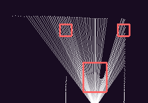

# Framework guide
This document explains the main principles of our programming framework and goes over some of the core components.
## The framework
Creating a good framework for programming the robot car was probably the most crucial step of the coding process. If done right, it could make creating the code for the open and obstacle challenge much easier. First of all, the framework involves both the ESP microcontroller and the Raspberry Pi. The connection/communication protocol and our heartbeat system is further detailed in the [Hardware documentation/#Protocols](/schemes/README.md/#Protocols). The ESP controls the motors and reads some sensors such as the IMU. The main job of the ESP in the framework is to do what the Raspberry tells it to, however it does have some intelligence on its own. This includes automatic target direction keeping via the IMU, steering using a `PID` algorithm, and target speed keeping also using `PID`. Another thing its responsible for is automatic IMU angle counting, what this entails is avoiding the IMU looping around at 360° back to 0° by detecting this and adding 360° to the count. Other than these functions it mainly awaits a request from the Raspberry and prepares an adequate response. The Raspberry-side of the framework is where most of the logic happens. There are 2 main threads, one for the challenge execution and one for reading and updating sensor values. This thread has a routine that is called every time the LiDAR makes a revolution, here we can do things that require fresh LiDAR data, such as wall following. This function is named `pilotRobot` and runs about 10 times a second. There is also another routine that is called 100 times a second, this is used for things that need a higher refresh rate, such as the IMU and the Raspberry Pi-side acceleration and deceleration, this function is named `accelerate`. We treat the ESP-side target speed keeping as near-instantaneous. Between running these routines the sensor thread is occupied with reading the incoming bits from the LiDAR, since we had to write our own Python library that processes LiDAR data packets, this is explained in more detail in the second paragraph of [Hardware documentation/#Protocols](/schemes/README.md/#Protocols). The main thread is for the challenge execution.
## Framework functions
Here are the most important **core** functions of our framework:
- `go`
  - Tells the ESP to start the motors and updates the target direction. This function is non-blocking, meaning after sending the request to the ESP it's over.
- `stop`
  - Tells the ESP to stop the motors, can optionally wait until it stops.
- `setTargetSpeed`
  - Sets the target speed for the Raspberry Pi-side acceleration.
- `waitCM`
  - Waits until the robot has traveled given centimeters, blocking the process until then.
- `readLidar` and `readAbsLidar`
  - Returns the distance at the given angle measured by the LiDAR. `readAbsLidar` combines the given angle with the heading measured by the IMU to calculate and absolute heading.
- `findNearestPoint` and `findNearestPointAbs`
  - Takes in coordinates for the bottom left and the top right corner of a rectangle. Returns the closest point found in that rectangle by the LiDAR. If none was found returns -1, this way it can also be used to check whether there is an object or not in the given area. `findNearestPointAbs` checks and area not relative to the robot but to the bottom left corner of the current section (where the back wall and the left-side wall meet).
   
   And example of this as seen in our [visualizer](/other/RpiCode/). This measurement takes place before the robot has started. It detects 3 things, a traffic sign in front of the robot and both walls in order to see which way it will have to turn. It finds nothing where the left wall could be, so the robot will turn left.
- `waitLidar` and `waitAbsLidar`
  - Waits until LiDAR measurement in given angle reaches the given distance. `waitAbsLidar` uses `readAbsLidar` instead of `readLidar`.
- `waitForHeading`
  - Waits until target heading (set by `go` or others) is reached, meaning the robot is facing in the right direction
- `waitTOF`
  - Waits until the laser distance Time of Flight sensor behind the robot reaches given distance. This sensor only works for distances less than 1 meter, this has to be kept in mind when using it.
- `getHeading`
  - Returns the current heading as measured by the gyro. Note that calling this function won't actually send a request to the ESP for a new IMU value, rather just returns the last stored value which updates about 100 times a second. This is done so we don't overload the `I2C` communication, some additional information about this can be found in the [Hardware documentation/#Protocols](/schemes/README.md/#Protocols)
- `arc`
  - Tells the ESP to turn the wheels to the maximum amount in the given direction and start the motors. Blocks until given heading angle is reached.
- `log.info`
  - Stores given log in a log file which can be viewed after the round is over or while the round is going via our [RpiCode extension](/other/RpiCode/)
- `setLane`
  - Moves the robot to the given distance from the given wall. For example, move to 20 centimeters from the left wall.
  
  These are just the core functions, for the challenge solution we created a lot of higher level functions, more about these can be found in the [Challenge solution](/README.md/#challenge-solution) document.
## Conclusion
Creating a good framework and the importance of one is one of the things we managed apply from our past Lego robotics experiences.